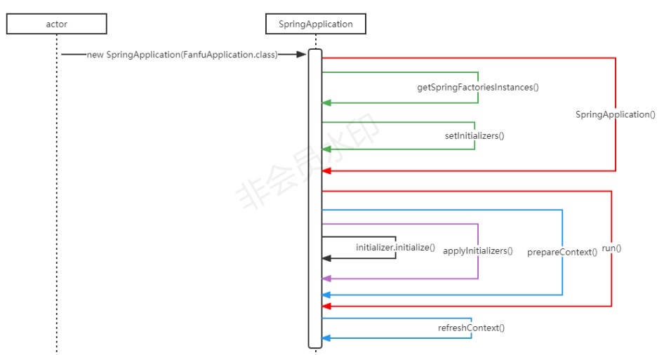

# 【Spring源码学习】ApplicationContextInitializer 详解

## 一、简介
`ApplicationContextInitializer`接口是Spring Framework提供的一个接口，用于在Spring应用程序上下文被创建但未刷新（refresh）之前初始化Spring ConfigurableApplicationContext 的回调接口，可以对上下文环境做一些操作，如运行环境属性注册、激活配置文件等。

## 二、接口代码：
```java
@FunctionalInterface
public interface ApplicationContextInitializer<C extends ConfigurableApplicationContext> {

	/**
	 * Initialize the given application context.
	 * @param applicationContext the application to configure
	 */
	void initialize(C applicationContext);

}
```

## 三、把实现类注册到Spring容器中
1. spring.factories
    > 在resource目录新建/META-INF/spring.factories文件，并预置一下内容，即可完成自定义ApplicationContextInitializer的注册：
`org.springframework.context.ApplicationContextInitializer=com.xx.config.MyApplicationContextInitializer`
2. 在application.properties文件中添加配置：
    这种添加方式也是靠ApplicationContextInitializer来实现的，DelegatingApplicationContextInitializer扫码环境属性"context.initializer.classes"下指定的其他初始化器的ApplicationContextInitializer
    >`context.initializer.classes=com.xx.config.MyApplicationContextInitializer`
3. springApplication.addInitializers()

## 四、初始化的时机
ApplicationContextInitializer接口的实现类的初始化，是在SpringApplication类的构造函数中，即spring容器初始化开始前，先通过 getSpringFactoriesInstances(...)得到所有实现类的集合，然后通过 setInitializers(...)注入到SpringApplication类的initializersn属性中；
```java
public SpringApplication(ResourceLoader resourceLoader, 
    Class<?>... primarySources) {
		this.resourceLoader = resourceLoader;
		Assert.notNull(primarySources, "PrimarySources must not be null");
		this.primarySources = new
		  LinkedHashSet<>(Arrays.asList(primarySources));
		this.webApplicationType = WebApplicationType.deduceFromClasspath();
		this.bootstrapRegistryInitializers = new ArrayList<>(
				getSpringFactoriesInstances(BootstrapRegistryInitializer.class));
      setInitializers((Collection)
        getSpringFactoriesInstances(ApplicationContextInitializer.class));
      setListeners((Collection)
        getSpringFactoriesInstances(ApplicationListener.class));
		this.mainApplicationClass = deduceMainApplicationClass();
}
```

## 五、执行时机
ApplicationContextInitializer接口的实现类的执行时机是在org.springframework.boot.SpringApplication#prepareContext-->org.springframework.boot.SpringApplication#applyInitializers中，即spring容器正式刷新前，准备上下文环境时；
遍历initializers，调用initialize()方法：
```java
	protected void applyInitializers(ConfigurableApplicationContext context) {
		for (ApplicationContextInitializer initializer : getInitializers()) {
			Class<?> requiredType = GenericTypeResolver.resolveTypeArgument(initializer.getClass(),
					ApplicationContextInitializer.class);
			Assert.isInstanceOf(requiredType, context, "Unable to call initializer.");
			initializer.initialize(context);
		}
	}
```




## 六、内置的实现类
Springboot内部也有一些内置的实现类，用于辅助spring相关功能的实现，常见的实现类如下：

1. **DelegatingApplicationContextInitializer**
    ApplicationContextInitializer的第二种实现方式（application.properties），在application.properties文件中配置context.initializer.classes=com.fanfu.config.MyApplicationContextInitializer，DelegatingApplicationContextInitializer的作用就是找到application.properties文件中配置的实现类实例化，并执行initialize()方法
    ```java
    @Override
	public void initialize(ConfigurableApplicationContext context) {
		ConfigurableEnvironment environment = context.getEnvironment();
		List<Class<?>> initializerClasses = getInitializerClasses(environment);
		if (!initializerClasses.isEmpty()) {
			applyInitializerClasses(context, initializerClasses);
		}
	}

	private List<Class<?>> getInitializerClasses(ConfigurableEnvironment env) {
		String classNames = env.getProperty(PROPERTY_NAME);
		List<Class<?>> classes = new ArrayList<>();
		if (StringUtils.hasLength(classNames)) {
			for (String className : StringUtils.tokenizeToStringArray(classNames, ",")) {
				classes.add(getInitializerClass(className));
			}
		}
		return classes;
	}
    ```
2. **ContextIdApplicationContextInitializer**
     ContextIdApplicationContextInitializer用于设置Spring应用上下文ID，如果在application.properties中未设置spring.application.name，则默认为"application"
    ```java
    private ContextId getContextId(ConfigurableApplicationContext applicationContext) {
		ApplicationContext parent = applicationContext.getParent();
		if (parent != null && parent.containsBean(ContextId.class.getName())) {
			return parent.getBean(ContextId.class).createChildId();
		}
		return new ContextId(getApplicationId(applicationContext.getEnvironment()));
	}

	private String getApplicationId(ConfigurableEnvironment environment) {
		String name = environment.getProperty("spring.application.name");
		return StringUtils.hasText(name) ? name : "application";
	}
    ```
3. **SharedMetadataReaderFactoryContextInitializer**
    实例化了一个org.springframework.boot.autoconfigure.SharedMetadataReaderFactoryContextInitializer.CachingMetadataReaderFactoryPostProcessor对象并注册到了Spring的上下文环境中
    ```java
    @Override
	public void initialize(ConfigurableApplicationContext applicationContext) {
		BeanFactoryPostProcessor postProcessor = new CachingMetadataReaderFactoryPostProcessor(applicationContext);
		applicationContext.addBeanFactoryPostProcessor(postProcessor);
	}
    ```