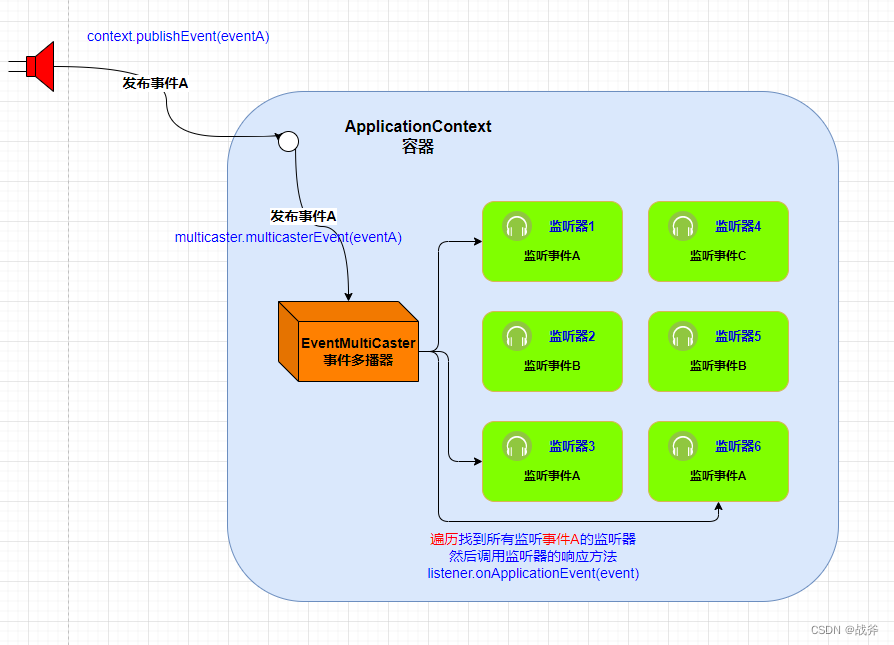

# Spring事件监听器ApplicationListener的使用与源码解析

**ApplicationListener**接口是Spring框架中用于监听应用程序事件的标准接口。它定义了单个方法`onApplicationEvent(ApplcationEvent event)`，用于处理特定类型的应用程序事件。通过实现该接口，可以监听并响应应用程序中的各种事件。
```java
@FunctionalInterface
public interface ApplicationListener<E extends ApplicationEvent> extends EventListener {

	/**
	 * Handle an application event.
	 * @param event the event to respond to
	 */
	void onApplicationEvent(E event);


	/**
	 * Create a new {@code ApplicationListener} for the given payload consumer.
	 * @param consumer the event payload consumer
	 * @param <T> the type of the event payload
	 * @return a corresponding {@code ApplicationListener} instance
	 * @since 5.3
	 * @see PayloadApplicationEvent
	 */
	static <T> ApplicationListener<PayloadApplicationEvent<T>> forPayload(Consumer<T> consumer) {
		return event -> consumer.accept(event.getPayload());
	}

}
```

在Spring中，虽说是通过ApplicationContext发布的事件，但其并不是自己进行事件的发布，而是引入了一个事件多播器ApplicationEventMulticaster。在org.springframework.context.support.AbstractApplicationContext#initApplicationEventMulticaster方法用对其进行了初始化，如果没有定义的情况下默认使用SimpleApplicationEventMulticaster。
```java
protected void initApplicationEventMulticaster() {
		ConfigurableListableBeanFactory beanFactory = getBeanFactory();
		if (beanFactory.containsLocalBean(APPLICATION_EVENT_MULTICASTER_BEAN_NAME)) {
			this.applicationEventMulticaster =
					beanFactory.getBean(APPLICATION_EVENT_MULTICASTER_BEAN_NAME, ApplicationEventMulticaster.class);
			if (logger.isTraceEnabled()) {
				logger.trace("Using ApplicationEventMulticaster [" + this.applicationEventMulticaster + "]");
			}
		}
		else {
			this.applicationEventMulticaster = new SimpleApplicationEventMulticaster(beanFactory);
			beanFactory.registerSingleton(APPLICATION_EVENT_MULTICASTER_BEAN_NAME, this.applicationEventMulticaster);
			if (logger.isTraceEnabled()) {
				logger.trace("No '" + APPLICATION_EVENT_MULTICASTER_BEAN_NAME + "' bean, using " +
						"[" + this.applicationEventMulticaster.getClass().getSimpleName() + "]");
			}
		}
	}
```

接下来看一下ApplicationEventMulticaster发布事件的过程：


获取适用该事件类型的监听器集合
```java
@Override
	public void multicastEvent(final ApplicationEvent event, @Nullable ResolvableType eventType) {
		ResolvableType type = (eventType != null ? eventType : resolveDefaultEventType(event));
		Executor executor = getTaskExecutor();
		for (ApplicationListener<?> listener : getApplicationListeners(event, type)) {
			if (executor != null) {
				executor.execute(() -> invokeListener(listener, event));
			}
			else {
				invokeListener(listener, event);
			}
		}
	}
```
调用监听器，最终执行listener.onApplicationEvent(event)
```java
protected void invokeListener(ApplicationListener<?> listener, ApplicationEvent event) {
		ErrorHandler errorHandler = getErrorHandler();
		if (errorHandler != null) {
			try {
				doInvokeListener(listener, event);
			}
			catch (Throwable err) {
				errorHandler.handleError(err);
			}
		}
		else {
			doInvokeListener(listener, event);
		}
	}

	@SuppressWarnings({"rawtypes", "unchecked"})
	private void doInvokeListener(ApplicationListener listener, ApplicationEvent event) {
		try {
			listener.onApplicationEvent(event);
		}
		catch (ClassCastException ex) {
			String msg = ex.getMessage();
			if (msg == null || matchesClassCastMessage(msg, event.getClass()) ||
					(event instanceof PayloadApplicationEvent &&
							matchesClassCastMessage(msg, ((PayloadApplicationEvent) event).getPayload().getClass()))) {
				// Possibly a lambda-defined listener which we could not resolve the generic event type for
				// -> let's suppress the exception.
				Log loggerToUse = this.lazyLogger;
				if (loggerToUse == null) {
					loggerToUse = LogFactory.getLog(getClass());
					this.lazyLogger = loggerToUse;
				}
				if (loggerToUse.isTraceEnabled()) {
					loggerToUse.trace("Non-matching event type for listener: " + listener, ex);
				}
			}
			else {
				throw ex;
			}
		}
	}
```

Spring也提供了如下几种内置事件：
* ContextRefreshedEvent：容器刷新完成发布这个事件
* ContextStartedEvent：容器开始执行时发布这个事件
* ContextStoppedEvent：容器停止时发布这个事件
* ContextClosedEvent：关闭容器发布这个事件
